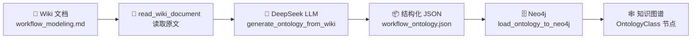
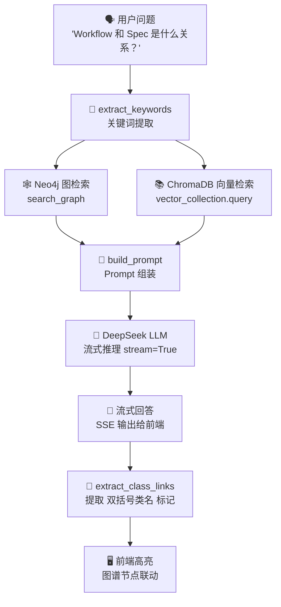
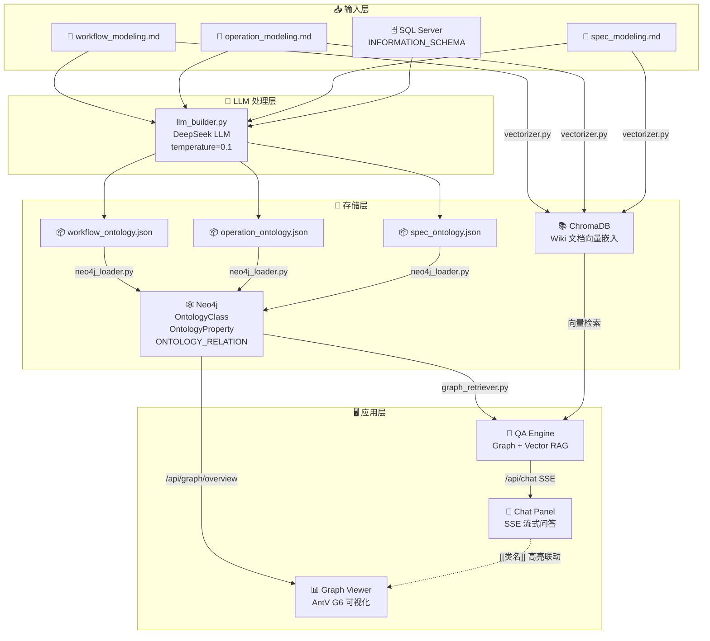

# LLM + Wiki 在 CamstarOntology 项目中的应用

> **项目名称**: CamstarOntology  
> **技术栈**: Python · Neo4j · DeepSeek LLM · FastAPI · AntV G6  
> **文档版本**: 2026-04-26

---

## 目录

1. [概述](#1-概述)
2. [应用场景一：本体自动生成 (Ontology Builder)](#2-应用场景一本体自动生成-ontology-builder)
3. [应用场景二：RAG 智能问答 (QA Engine)](#3-应用场景二rag-智能问答-qa-engine)
4. [核心模块与代码结构](#4-核心模块与代码结构)
5. [数据流全景图](#5-数据流全景图)
6. [LLM 配置与模型选择](#6-llm-配置与模型选择)
7. [总结](#7-总结)

---

## 1. 概述

本项目中，**LLM（大语言模型）** 与 **Wiki（Camstar 官方文档）** 的结合是整个系统的核心驱动力，贯穿从**知识提取**到**智能交互**的完整链路。两者的协作可以概括为：

```
Wiki 文档 ──→ LLM 理解 ──→ 结构化本体 ──→ Neo4j 图谱 ──→ LLM + RAG 问答
    ▲                                                          │
    └──────────── 形成知识闭环 ──────────────────────────────────┘
```

LLM 在本项目中承担**两个独立但关联的角色**：

| 角色 | 说明 | 入口模块 |
|------|------|----------|
| **本体工程师** | 阅读 Wiki 文档，提取类/属性/关系，生成结构化 JSON | `src/ontology/llm_builder.py` |
| **问答助手** | 基于图谱 + 向量检索的 RAG 架构，回答用户建模问题 | `src/qa/engine.py` |

---

## 2. 应用场景一：本体自动生成 (Ontology Builder)

### 2.1 问题背景

Camstar (Opcenter EX CR) 是一个复杂的 MES 系统，其建模概念（Workflow、Operation、Spec 等）分散在大量官方 Wiki/Help 文档中。传统方式需要领域专家逐字阅读文档、手工提取概念并建模，耗时数周。

| 传统方式 | LLM + Wiki 方式 |
|---|---|
| 人工阅读文档，逐字理解 | LLM 批量理解，输出结构化草稿 |
| 依赖专家，耗时数周 | 数小时生成初稿，人工审核 |
| 容易遗漏隐含关系 | LLM 可发现字段间潜在语义关联 |
| 文档和本体割裂 | 文档即输入，本体即输出，可溯源 |

### 2.2 Wiki 知识库目录

Wiki 文档（从 Camstar 官方 Help 文档转换而来）存放在 `src/ontology/wiki_kb/` 中，每个 `.md` 文件对应一个建模模块：

```
src/ontology/wiki_kb/
├── workflow_modeling.md        # 工作流建模文档 (48KB, 1186行)
├── workflow_ontology.json      # ← LLM 生成的本体 JSON
├── operation_modeling.md       # 工序建模文档 (112KB)
├── operation_ontology.json     # ← LLM 生成的本体 JSON
├── spec_modeling.md            # 规格建模文档 (293KB)
├── spec_ontology.json          # ← LLM 生成的本体 JSON
└── cross_module_ontology.json  # 跨模块关系补充（手工编写）
```

### 2.3 核心流程



**执行入口**：

- 单模块：直接运行 `python src/ontology/llm_builder.py`
- 批量多模块：运行 `python run_all_builders.py`

```python
# run_all_builders.py
if __name__ == "__main__":
    build_ontology("Operation Modeling", "operation_modeling.md", "operation_ontology.json")
    build_ontology("Spec Modeling", "spec_modeling.md", "spec_ontology.json")
```

### 2.4 LLM Prompt 设计

LLM 在本体生成中扮演「Camstar 领域专家 + 本体工程师」的角色。Prompt 策略如下：

**System Prompt**:
```
You are a professional Camstar ontology extraction tool. Output strictly valid JSON.
```

**User Prompt (简化)**:
```
你是一个经验丰富的 Camstar MES 领域专家和本体工程师。
下面是 Camstar {module_name} 模块的官方文档或知识内容：

======================================
{wiki_content}
======================================

请根据这些文档内容，提取该模块的本体类定义（Ontology Class）、
属性（Property）和关系（Relationship）。
请以 JSON 格式输出...
```

> [!IMPORTANT]
> **关键设计决策**：
> - **temperature = 0.1**：极低温度确保输出的确定性和结构一致性
> - **40,000 字符截断**：避免超出 LLM token 上限，大文档分批处理
> - **自动清洗**：自动剥离 LLM 输出中的 markdown 代码块标记（```json...```）

### 2.5 生成结果示例

以 `workflow_modeling.md` 为输入，LLM 自动提取了 **5 个本体类** 和 **10 条关系**：

| 本体类 | 中文名 | 属性数量 | 描述 |
|--------|--------|----------|------|
| `Workflow` | 工作流 | 7 | 定义生产流程的模型 |
| `WorkflowStep` | 工作流步骤 | 19 | 工作流中的一个处理步骤 |
| `WorkflowPath` | 工作流路径 | 12 | 步骤间的有向连线 |
| `PathSelector` | 路径选择器 | 7 | 基于条件自动选择路径 |
| `ReworkPathSelector` | 返工路径选择器 | 7 | 返工场景的路径选择条件 |

关系示例：
```
Workflow ──[HAS_STEP]──────────────→ WorkflowStep       (ONE_TO_MANY)
WorkflowStep ──[HAS_OUTGOING_PATH]──→ WorkflowPath      (ONE_TO_MANY)
WorkflowPath ──[LEADS_TO_STEP]──────→ WorkflowStep      (ONE_TO_ONE)
WorkflowStep ──[HAS_PATH_SELECTOR]──→ PathSelector       (ONE_TO_MANY)
WorkflowStep ──[REFERENCES_SUBWORKFLOW]→ Workflow        (ONE_TO_ONE)
```

### 2.6 数据库映射 (DB Schema Mapping)

除了从 Wiki 提取本体，LLM 还承担**本体→数据库映射**的任务：

```python
def map_ontology_to_db_schema(ontology_json: dict, db_schema_info: str) -> dict:
    """Use LLM to map the generated ontology to actual Database Tables/Columns."""
```

配合 `ontology_explorer.py` 的 `export_schema_for_llm()` 函数，将 SQL Server 的 `INFORMATION_SCHEMA` 扫描结果提供给 LLM，实现"本体属性名 ↔ 数据库字段名"的智能语义匹配。

### 2.7 写入 Neo4j

生成的 JSON 本体通过 `neo4j_loader.py` 写入图数据库，创建三类节点/关系：

```cypher
-- 1. 创建本体类节点
MERGE (c:OntologyClass {name: "Workflow"})
SET c.chineseName = "工作流", c.description = "...", c.layer = "Config"

-- 2. 创建属性节点并关联
MERGE (p:OntologyProperty {name: "revision", className: "Workflow"})
SET p.dataType = "String", p.description = "修订版本标识"
MERGE (c)-[:HAS_PROPERTY]->(p)

-- 3. 创建类间关系
MATCH (from:OntologyClass {name: "Workflow"})
MATCH (to:OntologyClass {name: "WorkflowStep"})
MERGE (from)-[r:ONTOLOGY_RELATION {name: "HAS_STEP"}]->(to)
SET r.cardinality = "ONE_TO_MANY"
```

---

## 3. 应用场景二：RAG 智能问答 (QA Engine)

### 3.1 问题背景

本体构建完成后，图谱中积累了丰富的 Camstar 建模知识。用户（如工厂 MES 工程师）需要一个直观的方式来查询和理解这些知识，而非直接阅读原始文档或操作 Cypher 查询。

### 3.2 混合 RAG 架构

QA Engine 采用 **Graph + Vector 混合 RAG** 架构，结合两条检索通道为 LLM 提供上下文：



### 3.3 检索链路详解

#### Step 1: 关键词提取 (`extract_keywords`)

采用双管齐下策略——直接匹配已知类名 + 中文词汇映射：

```python
CN_MAP = {
    "工作流": "Workflow", "工艺路线": "Workflow", "流程": "Workflow",
    "工步": "WorkflowStep", "步骤": "WorkflowStep",
    "规格": "Spec", "工序": "Operation",
    "返工": "Rework", "设备": "Resource",
    "数据采集": "DataCollection", "缺陷": "Defect", ...
}
```

#### Step 2: Neo4j 图检索 (`search_graph`)

从知识图谱中获取匹配类的**属性**和**1-hop 关系邻居**：

```cypher
MATCH (c:OntologyClass)
WHERE toLower(c.name) CONTAINS toLower($kw)
   OR toLower(c.chineseName) CONTAINS toLower($kw)
OPTIONAL MATCH (c)-[:HAS_PROPERTY]->(p:OntologyProperty)
OPTIONAL MATCH (c)-[r:ONTOLOGY_RELATION]-(neighbor:OntologyClass)
RETURN c.name, c.chineseName, c.description, props, rels
```

#### Step 3: 向量检索 (ChromaDB)

从 ChromaDB 中检索与问题语义最相近的 5 个文档片段，附带章节和页码元数据，格式化为：

```markdown
**[Chapter 4, P.42]**
Workflows are the fundamental components of modeling. A workflow is a sequence 
of steps used to manufacture a product...
```

#### Step 4: Prompt 组装 (`build_prompt`)

将图谱上下文和向量上下文注入结构化 Prompt：

```markdown
## 本体图谱上下文（来自 Neo4j 知识图谱）
### 涉及的本体类
- **Workflow** (工作流): 定义生产流程的模型...
### 类间关系
- Workflow —[HAS_STEP]→ WorkflowStep  (ONE_TO_MANY)
### 关键属性
- Workflow.revision (String): 修订版本标识

## 文档参考（来自 Opcenter 建模手册）
**[Chapter 4, P.42]** Workflows are the fundamental components...

## 用户问题
Workflow 和 Spec 是什么关系？
```

System Prompt 还约束了 LLM 的行为规范：
- 使用中文回答
- 涉及多个对象时使用**表格**
- 涉及步骤时使用**编号列表**
- 提及类名时用 `[[类名]]` 标记（如 `[[Workflow]]`）
- 信息不足时诚实说明

#### Step 5: LLM 流式推理

```python
response = client.chat.completions.create(
    model=model,
    messages=messages,
    stream=True,          # 流式输出，减少首字延迟
    temperature=0.3,      # 平衡创造性与准确性
    max_tokens=2048,
)
```

通过 FastAPI 的 StreamingResponse 将每个 token 实时推送到前端。

### 3.4 图谱联动

LLM 回答中使用 `[[类名]]` 标记（如 `[[Workflow]]`），前端 `chat.js` 自动检测这些标记并高亮对应的 AntV G6 图谱节点，实现**问答与可视化的双向联动**。

### 3.5 会话管理

服务端维护 Session 级别的对话历史（最近 10 轮），支持多轮追问：

```python
# server.py
_chat_sessions = {}  # { session_id: [{role, content}, ...] }
```

---

## 4. 核心模块与代码结构

```
CamstarOntology/
│
├── src/
│   ├── ontology/                       # ── 本体管理 ──
│   │   ├── llm_builder.py             # 🔑 LLM 本体生成核心
│   │   │   ├── read_wiki_document()          # 读取 Wiki 原文
│   │   │   ├── generate_ontology_from_wiki() # Wiki → JSON 本体
│   │   │   └── map_ontology_to_db_schema()   # 本体 ↔ DB 映射
│   │   ├── wiki_kb/                   # 📚 Wiki 文档 + 生成结果
│   │   │   ├── *.md                          # 输入：Wiki 原文
│   │   │   └── *_ontology.json               # 输出：LLM 生成的本体
│   │   ├── loader/
│   │   │   └── neo4j_loader.py        # JSON → Neo4j 写入
│   │   └── explorer/
│   │       └── ontology_explorer.py   # SQL Server 表结构扫描
│   │
│   └── qa/                            # ── 智能问答 ──
│       ├── engine.py                  # 🔑 QA 引擎（RAG 编排）
│       │   ├── extract_keywords()            # 关键词提取
│       │   ├── query_stream()                # 流式问答主函数
│       │   └── extract_class_links()         # 提取[[类名]]标记
│       ├── graph_retriever.py         # Neo4j 图检索
│       │   ├── search_graph()                # 1-hop 邻居检索
│       │   ├── format_graph_context()        # 格式化图谱上下文
│       │   └── get_all_class_names()         # 获取所有类名
│       └── prompt_builder.py          # Prompt 模板 & 组装
│           ├── SYSTEM_PROMPT                 # 系统角色设定
│           ├── build_prompt()                # 上下文注入
│           └── format_vector_results()       # 向量结果格式化
│
├── web/
│   ├── server.py                      # FastAPI API 服务
│   │   ├── /api/graph/overview        # 图谱概览 API
│   │   ├── /api/graph/class/<name>    # 类详情 API
│   │   ├── /api/chat                  # SSE 流式问答 API
│   │   └── /api/chat/clear            # 清空会话 API
│   └── static/
│       ├── index.html                 # 主页面
│       ├── style.css                  # 样式
│       ├── app.js                     # AntV G6 图谱渲染
│       └── chat.js                    # Chat Panel 交互
│
├── run_all_builders.py                # 批量本体生成入口
└── .env                               # LLM 密钥 & 模型配置
```

---

## 5. 数据流全景图



---

## 6. LLM 配置与模型选择

本项目通过 `.env` 文件统一配置 LLM 参数：

```ini
# DeepSeek LLM 配置
DEEPSEEK_API_KEY=your_deepseek_api_key_here
DEEPSEEK_BASE_URL=https://api.deepseek.com/v1
LLM_MODEL=deepseek-v4-pro
```

| 参数 | 用途 | 说明 |
|------|------|------|
| `DEEPSEEK_API_KEY` | API 认证 | DeepSeek 平台密钥 |
| `DEEPSEEK_BASE_URL` | API 基础地址 | 兼容 OpenAI SDK 格式 |
| `LLM_MODEL` | 模型选择 | 本体生成 (llm_builder) 和问答 (engine) 共用 |

> [!TIP]
> 项目使用 OpenAI Python SDK 的兼容接口调用 DeepSeek API，因此如需切换为其他 LLM 提供商（如 OpenAI GPT-4、Claude 等），只需修改 `.env` 中的三个环境变量即可，代码无需改动。

**两个场景的 LLM 参数对比**：

| 参数 | 本体生成 | 问答推理 |
|------|----------|----------|
| `temperature` | 0.1（高确定性） | 0.3（平衡创造性） |
| `stream` | ❌ 否 | ✅ 是 |
| `max_tokens` | 默认 | 2048 |
| 输出格式 | 严格 JSON | 自然语言 + [[标记]] |

---

## 7. 总结

| 维度 | Wiki 的作用 | LLM 的作用 |
|------|-------------|------------|
| **知识来源** | 提供 Camstar MES 的权威领域知识 | 理解并结构化 Wiki 内容 |
| **本体生成** | 作为 LLM 的输入素材（.md 文件） | 自动提取类、属性、关系，输出 JSON |
| **DB 映射** | — | 将本体属性与数据库字段进行语义对齐 |
| **问答上下文** | 向量化后作为 RAG 检索源 | 融合图谱+文档上下文，生成自然语言回答 |
| **图谱联动** | — | 输出 `[[类名]]` 标记，驱动前端图谱节点高亮 |

> [!NOTE]
> **一句话总结**：Wiki 是知识的源头，LLM 是连接知识与应用的桥梁——从「文档」到「本体」到「图谱」到「智能问答」，LLM + Wiki 构成了本项目的核心知识流转管线。
