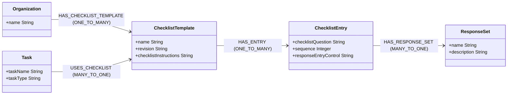

# Checklist Module Modeling Guide

The **Checklist** module in Siemens Opcenter Camstar enables administrators to define structured checklists of items (questions, tasks, or verifications) that must be answered or performed by operators on the shop floor or quality engineers during compliance processing.

---

## 1. Domain Overview

Checklists ensure strict adherence to standardized work instructions and quality assurance checks. They can be assigned to different levels:
*   **Organization**: Global compliance checklists required for organization-level actions or defaults.
*   **Triage Spec / Quality Event**: Quality review checklists completed by engineers during nonconformance/CAPA triage.
*   **Electronic Procedure Task**: Shop floor checklists executed by operators during production steps (e.g. equipment set-up or machine clearance).

---

## 2. Core Entities

### ChecklistTemplate (检查表模板)
The master blue-print for a checklist. It contains header information, version control, and completion instructions.
*   `checklistInstructions` (填写指南): Header instructions displayed to the user when filling out the checklist.

### ChecklistEntry (检查表项)
Represents a single row/question in the checklist template configuration grid.
*   `checklistQuestion`: The actual text of the question or instructions (e.g., *“Did the product pass all quality tests?”*).
*   `responseEntryControl`: The UI control for answers:
    *   `Radio Button`
    *   `Check Box`
    *   `Picklist`
*   `commentsEntry`: Constraints on operator comments:
    *   `None` (no comment box)
    *   `Optional`
    *   `Required`
*   `responseLayout`: Position of responses relative to the question (`Below-Vertical`, `Below-Horizontal`, `Right`, `Left`).

### ResponseSet (答案选项集)
Predefined answers (e.g. *“Yes, No, NA”*, *“Pass, Fail, Untested”*) mapped to checklist items. We recommend keeping response sets to a maximum of 5 items for optimal UI/UX.

---

## 3. Relationships

