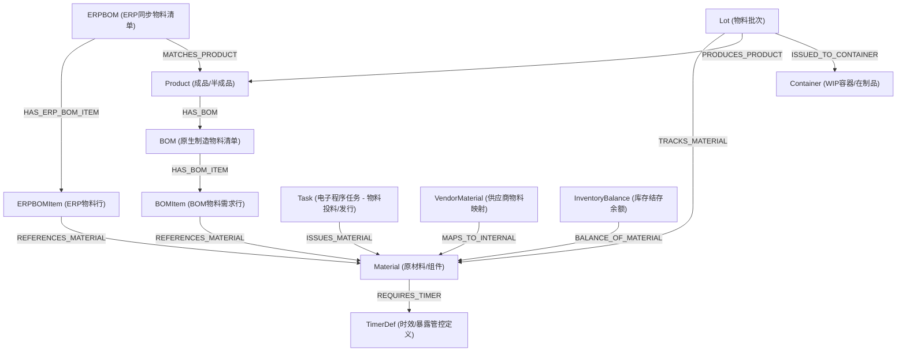

# Chapter 16: Material and BOM Modeling / 第 16 章：物料与物料清单建模

## Introduction / 导言
Materials and Bills of Materials (BOM) define the components required to assemble or manufacture a product. They form the foundational master data for raw materials, sub-assemblies, consumables, and their assembly relationships. 

物料与物料清单（BOM）定义了组装或制造产品所需的全部组件。它们构成了原材料、子装配件、原辅料及其装配关系的底层基础主数据。

In InSite (Opcenter Execution / Camstar), a **Material** is a specialized semantic entity represented under the hood by a `Product` CDO where `ProductType = RawMaterial` (CDODefId: 502). By establishing a clear semantic separation between a finished **Product** and a raw **Material**, the ontology enables robust structural definition, lot tracking, environmental exposure limits, and ERP synchronization.

在 InSite (Opcenter Execution / Camstar) 中，**Material（原材料）** 是一种特殊的语义实体，底层由 `ProductType = RawMaterial` 的 `Product` CDO (CDODefId: 502) 承载。通过在本体模型中将成品 **Product** 与 **Material** 进行清晰的语义解耦，我们能够更精准地定义物料结构、进行批次追踪、设置环境暴露时效以及对接 ERP 同步。

---

## Entity Relationships / 实体关系架构
The structural relationships connecting product demand, BOMs, ERP BOMs, Lots, and Materials follow this unified model:

物料需求、BOM、ERP BOM、批次与物料之间的关联关系如下：

---

## Material Class Definitions & Properties / 原材料类定义与属性表
The `Material` class represents any raw input, subassembly, or consumable. In addition to standard product master metadata, it includes specialized control flags and properties for time-sensitive environmental controls (e.g., cold-storage thawing, room temperature exposure).

`Material` 类代表任何原材料、子装配件或原辅耗料。除了标准主数据外，它还引入了针对温湿度敏感物料（如锡膏、胶水、半导体晶圆芯片）的时效与环境暴露控制属性。

### Material Property Catalog / 物料属性目录

| Property Name / 属性名称 | Type / 类型 | Chinese Description / 中文描述 | English Description / 英文描述 |
| :--- | :--- | :--- | :--- |
| **materialName** | String | 物料名称（唯一标识） | Unique material name/identifier (Primary Key). |
| **description** | String | 物料描述（可选） | Description of the material (Optional). |
| **materialCategory** | String | 物料分类类别（如电子件、结构件、原辅料等） | Classification category of the material. |
| **unitOfMeasure** | String | 计量单位（如 KG, PCS, Liters） | Base Unit of Measure (UOM) for inventory tracking. |
| **shelfLife** | Integer | 保质期时长（单位：天） | Standard shelf life duration in days. |
| **supplier** | String | 首选供应商名称 | Preferred supplier or primary manufacturer. |
| **status** | Integer | 状态码：1=Active (启用), 2=Inactive (禁用) | Status code: 1=Active, 2=Inactive. |
| **isFrozen** | Boolean | 该物料定义实例是否已被冻结（只读，防篡改） | Indicates if the material definition instance is frozen. |
| **isPhantom** | Boolean | 是否为虚拟件（只在BOM中作为逻辑层级，无实体） | Indicates if it is a phantom item used only for logical grouping. |
| **lotControlled** | Boolean | 是否批次控制。为True时，在发料与投料中强制批次追踪 | If true, lot tracking is enforced during material issue & assembly. |
| **serialControlled** | Boolean | 是否单件序列号控制。为True时，投料时强制校对序列号 | If true, individual serial verification is enforced at assembly steps. |
| **inventoryControlled** | Boolean | 是否执行实物出入库及结存余额管控 | If true, physical inventory balances are tracked in MES. |
| **fefoEnforce** | Integer | 是否强制执行FEFO（先失效先发料）：0=否, 1=是 | Enforce First-Expired-First-Out rule: 0=No, 1=Yes. |
| **materialAccumulateExposure**| Boolean | 是否启用温湿度敏感物料（MSD）的室温暴露时间累积 | Enable room-temperature exposure cumulative calculations. |
| **materialExposureDuration** | Float | 敏感物料允许的最大室温暴露时间上限（小时） | Maximum allowed cumulative exposure duration (hours). |
| **materialThawingDuration** | Float | 敏感物料从冷藏取出后必须的化冻/回温时长（小时） | Required warming/thawing time before material usage (hours). |
| **materialMaxReturns** | Integer | 敏感物料允许的最大温控往返/退库回温次数上限 | Maximum times a material can be returned and rewarmed. |
| **warningExpiryDuration** | Float | 有效期到期前的前置预警提示时间（天） | Expiry warning lead time in days prior to actual expiration. |

---

## Relationship Registry / 关联关系注册表
The graph database establishes clean structural pathways to Material from other modules:

图谱中定义了从其他业务组件指向 `Material` 的强类型关联关系：

### 1. BOMItem → Material (`REFERENCES_MATERIAL`)
*   **Module / 所属模块**: `bom`
*   **Cardinality / 基数**: `MANY_TO_ONE`
*   **Description (CN)**: BOM 物料需求行指向具体的原材料/子装配件。这是产品配方到实物需求的关键桥梁。
*   **Description (EN)**: Connects a specific BOM line requirement item to its material definition.

### 2. ERPBOMItem → Material (`REFERENCES_MATERIAL`)
*   **Module / 所属模块**: `erpbom`
*   **Cardinality / 基数**: `MANY_TO_ONE`
*   **Description (CN)**: ERP 同步物料需求行（如 SAP BOM Item）引用具体的原材料。
*   **Description (EN)**: Connects an externally managed ERP BOM component item to its internal material definition.

### 3. Lot → Material (`TRACKS_MATERIAL`)
*   **Module / 所属模块**: `cross_module`
*   **Cardinality / 基数**: `MANY_TO_ONE`
*   **Description (CN)**: 生产批次或外购批次（Lot）指向其对应的物料定义，以提供批次级库存属性。
*   **Description (EN)**: Traces a specific active batch/inventory lot to its catalog material definition.

### 4. Task → Material (`ISSUES_MATERIAL`)
*   **Module / 所属模块**: `electronic_procedure`
*   **Cardinality / 基数**: `MANY_TO_ONE`
*   **Description (CN)**: 电子流程（E-Procedure）中的“物料发行/发料”类型任务（MaterialIssue Task）所指定的需求物料。
*   **Description (EN)**: Associates an interactive MaterialIssue execution step with its target Material.

### 5. VendorMaterial → Material (`MAPS_TO_INTERNAL`)
*   **Module / 所属模块**: `supplier`
*   **Cardinality / 基数**: `MANY_TO_ONE`
*   **Description (CN)**: 供应商特定的物料型号与 MES 内部统一物料编号（Material）之间的对照映射关系。
*   **Description (EN)**: Maps a vendor-specific part number to the internal master material catalog.

### 6. InventoryBalance → Material (`BALANCE_OF_MATERIAL`)
*   **Module / 所属模块**: `inventory`
*   **Cardinality / 基数**: `MANY_TO_ONE`
*   **Description (CN)**: 库存结存余额记录关联的具体实物对象。
*   **Description (EN)**: Links an active physical inventory balance location to its material master definition.

### 7. Material → TimerDef (`REQUIRES_TIMER`)
*   **Module / 所属模块**: `timer`
*   **Cardinality / 基数**: `MANY_TO_ONE`
*   **Description (CN)**: 温湿度敏感物料（如锡膏/化学辅料）在出库后强制绑定的环境暴露时限和化冻时效计时器模板。
*   **Description (EN)**: Mandates environmental timer constraint rules for exposure-sensitive materials.
