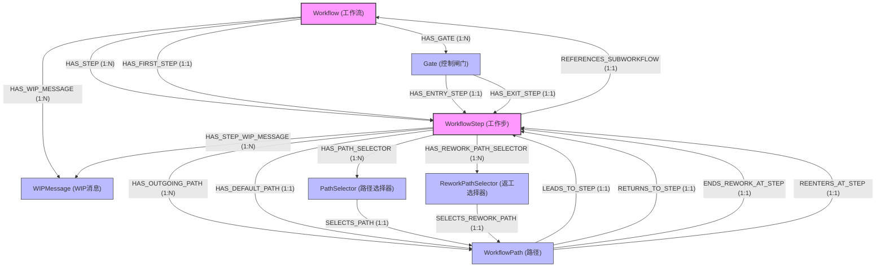
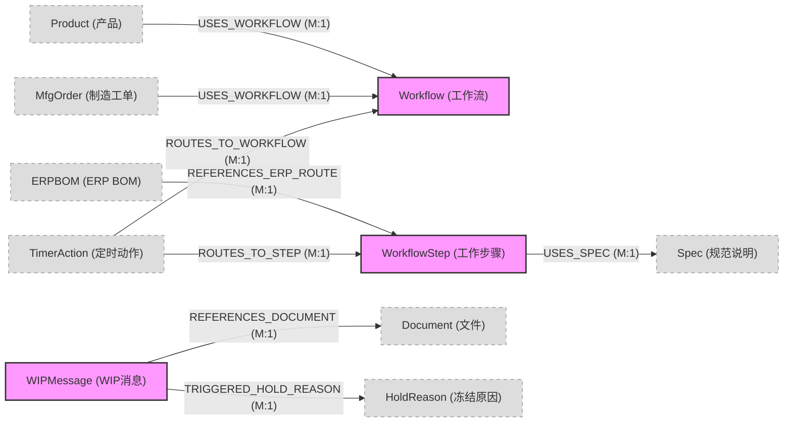

Chapter 4: Workflows
Introduction
Workflows are the fundamental components of modeling. A workflow is a sequence of steps used to 
manufacture a product. The step sequence indicates the route through which a container must move and 
the data that must be recorded. Not all products need a workflow. Items such as raw materials or 
packaging components have product definitions but may not have a workflow associated with them. 
The nature of your workflow depends upon the modeling definitions you establish. Therefore, before you 
begin to develop your workflow, you must create a minimum number of modeling definitions. You use 
these modeling definitions as essential elements of the workflow.
In This Chapter
This chapter contains these topics:
•
Understanding Workflows
•
Designing Workflows
•
Using Path Selectors
Release 2510+ Rev. 1
Modeling User Guide
4-1
Chapter 4: Workflows
Understanding Workflows
A workflow is a sequence of steps that are used to manufacture a product. A product definition may 
reference a default workflow that defines the route and processing required to manufacture the product. 
Workflows can include multiple elements: 
•
Steps
•
Paths
•
Routes
•
Sub-workflows
Steps
A step defines the processing for that point in the workflow. Each step refers to a set of instructions that 
may include a combination of the following:
•
Tasks to be performed by an employee
•
Events that must occur to process the container at that step
Each step references a specification or another workflow (sub-workflow). A spec is a revisioned object that 
defines the activities carried out at the step. The spec includes the processing instructions for how work is 
performed. Refer to "Defining Specs" for  information on specs.
A workflow step is a step in a workflow or sub-workflow that points to a separate workflow through a 
spec.
A step can contain zero paths, one path, or multiple paths. When a step contains multiple paths, typically 
there is one default path to another step and alternate paths to other steps.
Optional Steps
The Optional check box, selected on a spec or directly on a workflow step instance of a spec, is used when 
the spec is also configured with a resource group.  The resource group on a spec validates the resource that 
is specified in a transaction and will block the transaction from executing if the resource is not valid for the 
spec.  
When the Optional check box is selected for the current spec for a container and the resource validation 
fails, the system evaluates future steps by reviewing the configured paths in a workflow to see if the 
resource is valid at a future step.  As soon as a future step is not configured as optional, the system 
immediately returns the error that the resource is not valid for the resource group on the current spec for 
the container.  However, if it finds a step where the resource is valid, it executes the transaction for the 
container at that workflow step.  If this is a movement transaction (for example, MoveIn or MoveStd) the 
container is moved into or through the future workflow step.
4-2
Modeling User Guide
Release 2510+ Rev. 1
Chapter 4: Workflows
Paths
The direction from one step to the next is called a path. A workflow can have alternate paths from any 
given step. When alternate paths are available, you can use path selectors to indicate a particular 
direction.
•
Default - Indicated by a solid line. A container follows the default path unless a path selector 
statement for an alternate path is true.
•
Alternate - Indicated by a dotted line. Alternate paths and routes accommodate the need for 
processing outside the default route. You can create multiple alternate paths from a step and also 
nest alternate routes. A container follows an alternate path when the path selector for that path 
is true.
•
Rework - Indicated by a red dotted line. Rework is a manufacturing process during which current 
work goes through extra processing steps to correct a problem that occurred during normal 
processing. A looped path is one type of rework path. It returns the container to the beginning of 
its current step. Refer to "Rework Paths" for  information.
•
Looped - Indicated by a  line that points back to the step the user is on already. A looped path 
returns a container to the beginning of its current step when a reason to reprocess the container 
is at the same step. For example, a container that does not meet specified parametric data 
requirements at a particular step is returned to the same step for reprocessing until it meets the 
requirements. After the requirements are met, the container can continue along its  path.
Rework Paths
Rework is defined as a manufacturing process where current work goes through extra processing steps to 
correct a problem or an undesirable result that occurred during normal processing. 
Some business rules necessitate a path from a step back to itself or to a previous step. For example, at a 
certain step, a coil of metal needs to be rolled to a certain thickness before it can be moved to the next 
step. If the thickness is not right, the coil goes back in for more rolling until it achieves the right thickness. 
You can accomplish this by creating looped paths.
During manufacturing, an operator may also need to reroute current work back through previous steps. 
For example, if a product does not meet quality standards, it may need to go back through the previous 
processing steps. You can accomplish this by creating rework paths.
Note:
An operator can only send a product through rework if predefined paths are set up during mod-
eling, and the operators are limited to the specific constraints set up in the predefined rework 
paths. For example, an operator can choose to send a product through the Extra Work rework 
path from the Stamp step only if the workflow was set up with those specific constraints.
Routes
A route is a sequence of steps that are linked using paths. A workflow can include multiple routes with one 
default route. Path selector statements determine the route, default or alternate, a container will follow 
through the workflow. Refer to "Using Path Selectors" for  information. Examples of alternate routes can be 
rework or products that require additional or various processing. 
Release 2510+ Rev. 1
Modeling User Guide
4-3
Chapter 4: Workflows
Sub-Workflows
A sub-workflow is an independent workflow that is referenced at a workflow step. If a specific step is 
complicated, it may need to refer to a sub-workflow that has its own steps and specs attached to it. Sub-
workflows are not alternate paths; they are independent workflows in themselves. They become sub-
workflows when they are referenced by a specific step from another workflow. 
Different workflows can reference the same workflow as a sub-workflow. For example, if you have two 
physical locations producing similar items, the locations may use different revisions of the main workflow, 
and then reference the same sub-workflow at some point.
Sometimes, the processing details within a step can be too complicated to be encapsulated within a spec. 
In this case, the step can reference another workflow (therefore making the referenced workflow a sub-
workflow). Sub-workflows are independent workflows in themselves and can be referenced by multiple 
workflows.
You can open a referenced sub-workflow from the Workflow diagram by selecting the sub-workflow step 
and clicking the Open Subworkflow button. The sub-workflow appears in a separate  tab and allows you to 
view and modify the sub-workflow.
Moving Containers Through a Workflow
Using paths and routes helps to control container movement on the shop floor. You cannot use the Move 
(standard) transaction to move a container from the default route if an alternate path is not defined.
You can configure the application to choose the correct path based on characteristics of the container by 
creating path selector statements that automatically determine the path to take. Refer to "Using Path 
Selectors"  for  information. 
4-4
Modeling User Guide
Release 2510+ Rev. 1
Chapter 4: Workflows
Workflow Diagram
This diagram illustrates the elements in a workflow and their relationships to one another.
Working with Step Details
Each step has details that determine its use in the workflow. Many details are application defaults  you can 
modify. Changes made to a step within a workflow affect that step only. You can modify the following 
types of information for a step:
•
General - Includes values such as step name and description, the sequence of the step in the 
workflow, the associated spec or sub-workflow, and so on. You can modify all general 
information except the sequence. When modifying spec or sub-workflow information, you can set 
the spec or sub-workflow to the revision of record or to a specific revision.
•
Path Selectors - Path selectors provide alternate paths based on specified conditions that override 
the default path.  The application checks for path selectors before proceeding along the default 
path. Refer to "Using Path Selectors" for  information.
Release 2510+ Rev. 1
Modeling User Guide
4-5
Chapter 4: Workflows
•
Rework Path Selectors - Rework path selectors exist for the same reason as path selectors. If a 
container needs rework and more than one rework step is possible, you define rework path 
selectors to specify the conditions under which the container follows one rework path or another.
Note:
The user can override rework path selectors by manually selecting another path while 
performing the Rework transaction.
•
Scheduling Details - Defaults from the associated spec or sub-workflow. You can modify 
scheduling information to accommodate step-specific requirements. The information you enter 
here overrides the default scheduling information in the associated spec or sub-workflow but 
does not affect the spec or sub-workflow.
Select the step in the workflow and click the Modify Element button to view the Step Details pop-up.
Working with Path Details
Like steps, each path has details that define its use in the workflow, and many of the details are 
application defaults you can modify. Changes made to a path in a workflow affect that path only.
Path detail information includes the path’s from and to steps and whether the path is on the default or 
alternate route. You can modify all path information except the from and to steps and the default  path 
selection.  
Select the path in the workflow and click the Modify Element button to view the Path Details pop-up. The 
type of path determines the pop-up displayed. The Rework Path Details pop-up appears for rework paths, 
and the Path Details pop-up appears for all other path types.
Expanding the Workflow Diagram
You can display the Workflow Diagram in a resizable pop-up by clicking the Maximize Area button on the 
Workflow Diagram toolbar. The  pop-up allows you to expand the working area to better view the 
workflow. The pop-up contains the same options for building and modifying the workflow as the 
Workflow page.
Clicking  OK  closes the pop-up and displays the workflow and any modifications made to the workflow in 
the Workflow Diagram on the Workflow page. Clicking Cancel displays a confirmation dialog box. Clicking 
Yes on the dialog box closes the pop-up and does not retain any modifications made to the workflow.
4-6
Modeling User Guide
Release 2510+ Rev. 1
Chapter 4: Workflows
Workflow Page
This image shows an example of the Workflow page.
Workflow Page Field Definitions
This table defines the fields on the Workflow page.
Refer to "Common Fields on Modeling Pages" for information on the fields common to all modeling 
objects.
Field
Definition
Type
General
Engineering 
Change Order
Engineering change order assigned to this revision. You can enter a 
maximum of 30 characters.
Optional 
ERP Route
Reference to the ERP Route to which this ERP BOM is associated.
Optional
Scheduling Route
Alternative scheduling route to an ERP route. Scheduling routes take 
precedence over ERP routes in workflows. Refer to "Defining 
Scheduling Routes" for information.
Optional
Release 2510+ Rev. 1
Modeling User Guide
4-7
Chapter 4: Workflows
Field
Definition
Type
Remaining 
Process Time
Flag that enabled the calculations of the remaining process time 
(RPT) for WIP as  containers are started and processed through spec or 
workflow.
Optional
Workflow Diagram
Workflow 
Diagram
Diagram of the selected workflow steps and paths. Diagram allows 
you to build and modify workflows. Refer to  "Designing Workflows" 
for information on workflow design.
Optional
Workflow Diagram Toolbar
This table describes the controls and buttons on the Workflow Diagram.
Control/Button
Click this button to . . .
Set the magnification of the workflow.
Fit the workflow into the workflow diagram workspace.
Display the current workflow diagram in a resizable pop-up.
Delete the selected step, path, or sub-workflow.
Display the details pop-up for the selected step or path. The application displays 
this button only when you select a step or path.
Display the selected sub-workflow in a separate Workflow tab.
4-8
Modeling User Guide
Release 2510+ Rev. 1
Chapter 4: Workflows
Step Details Pop-Up
This image shows an example of the Step Details pop-up for a spec step. 
Step Details Pop-Up Field Definitions
This table defines the fields on the Step Details pop-up.
Field
Definition
Type
Step Name
Unique name for this spec step.  The application uses the name of 
the spec as the default name for the step.
Note: This field appears when you view the Step Details pop-up 
for a spec step.
Required
Sub Workflow Step
Unique name for this sub-workflow step. The application uses the 
name of the sub-workflow as the default name for the step.
Note: This field appears when you view the Step Details pop-up 
for a sub-workflow step.
Required
Release 2510+ Rev. 1
Modeling User Guide
4-9
Chapter 4: Workflows
Field
Definition
Type
Is First Step
Check box indicating that this is the first step. By default, it is set 
to true (selected). It is read-only for the default first step. It is 
selected and editable for other steps. You must use this field to 
designate another step as the first step  if you delete the original 
first step.
Note: The application displays an error message when you save 
the workflow if you delete the first step and do not designate 
another step as the first step. 
Optional
Is Last Step
Check box indicating that this is the last step. This box is not 
selected by default. You must use this field to proceed to the final 
step. This ensures accurate reporting for the Yield, Throughput, 
and Cycle Time reports.
Optional
Optional
Defines whether the step is optional in the workflow. Available 
options are:
•
Not Set
•
Yes
•
No
Optional
Description
Description of this step. You can enter a maximum of 255 
characters.
Optional
Notes
Any relevant comments about this step. You can enter a maximum 
of 2000 characters.
Optional
Spec
Specification associated with this step.
Note: This field appears when you view the Step Details pop-up 
for a spec step.
Required
Workflows
Workflow associated with this step.
Note: This fields appears when you view the Step Details pop-up 
for a sub-workflow step.
Required
Route Step
ERP route associated with this step. The ERP Route object is 
provided in the model for creating this data manually or through 
an interface of the ERP.
Optional
WIP Msg Label
Identifier for relating a WIP Message to one or more steps. WIP 
Messages defined for all Modeling entities except a Step or 
Operation can be qualified with a WIP Message Label. This allows 
the same message to be associated with multiple steps.
Optional
Sequence
Relative sequence of this step within the workflow. This value is 
used to retrieve (via SQL) steps in order. Steps along the alternate 
route have sequence 0.
Display 
Only
Scheduling Route 
Step
Route step within the Scheduling Route.
Optional
4-10
Modeling User Guide
Release 2510+ Rev. 1
Chapter 4: Workflows
Field
Definition
Type
Path Selectors grid
Grid listing statements evaluated to determine whether the 
container moves along the default path or an alternate path. Refer 
to "Using Path Selectors" for  information.
Optional
Expression
Statement the application  evaluates to determine the path for the 
container.
Optional
Path to Use
Path the container will follow if the expression is true.
Optional
Status
Active or Inactive. The application  evaluates the selector 
statement when the status is active and skips the selector 
statement when the status is inactive. 
Optional
Description
Text to describe the path selector. You can enter a maximum of 
255 characters.
Optional
Effective 
From Date
Beginning date and time of the range within which the application 
evaluates the statement. The application will skip the statement if 
the current date is outside the effective date range.
Optional
Effective To 
Date
Last date and time of the range within which the application  
evaluates the statement. The application will skip the statement if 
the current date is outside the effective date range.
Optional
Notes
Comments relevant to the path selector statement. You can enter 
a maximum of 2000 characters.
Optional
Rework Path 
Selectors grid
Grid listing statements evaluated to determine whether the 
container moves along the default rework path or an alternate 
path. Refer to "Using Path Selectors" for  information.
Optional
Standard Batch Size
Standard size of a batch of material processed using this Spec. This 
value is used in cycle time and Cost Accounting calculations.
Optional
Yield
Value specifiying the standard yield expected for processing with 
this Spec. This value is used in cycle time and Cost Accounting 
calculations.
Optional
Setup Time
Value specifying the time required for a Setup at this Operation. 
This value is used in cycle time and Cost Accounting calculations.
Optional
Run Rate Option
Value specifying whether the run rate is hours per unit or units per 
hour. The values are:
•
Hours Per Unit (RunRateTime)
•
Units Per Hour (RunRateQty)
Optional
Duration Per Unit
Value specifying the amount of time needed to process a single 
unit. This value is used in cycle time and Cost Accounting 
calculations.
Optional
Units Per Hour
Number of units processed in an hour. This value is used in cycle 
time and Cost Accounting calculations.
Optional
Normal Cycle Time
Time required to process a standard size batch of material using 
this Spec, assuming normal queue time. The value that is persisted 
is only valid at the point in time  this Spec was saved.
Optional
Release 2510+ Rev. 1
Modeling User Guide
4-11
Chapter 4: Workflows
Field
Definition
Type
Fast Cycle Time
Time required to process a standard size batch of material using 
this Spec, assuming fast queue time. This is used to determine, for 
example, how quickly a job can be expedited through the Factory. 
The value that is persisted is only valid at the point in time this 
Spec was saved.
Optional
Path Details Pop-Up
This image shows an example of the Path Details pop-up.
Path Details Pop-Up Field Definitions
This table defines the fields on the Path Details pop-up.
Field
Definition
Type
Path Name
Unique name for this path. By default, it is the name of the step to which 
this path is going.
Required
Description
Short description of this path. You can enter a maximum of 255 
characters.
Optional
From Step 
Step where the path started.
Display 
Only
On Default 
Route
Check box indicating that this path is on the default route.
Display 
Only
4-12
Modeling User Guide
Release 2510+ Rev. 1
Chapter 4: Workflows
Field
Definition
Type
To Step
Step to which this path is going.
Display 
Only
Is Default Path Check box indicating that this path is the default for the step. This field is 
enabled if you select an alternate path. It becomes the default and the 
original default becomes an alternate path if you click this field on an 
alternate path.
Display 
Only/ 
Optional
RPT Bulk Delta
Difference of processing time between the original workflow steps and 
the alternate workflow steps for the bulk data (where process time is 
independent of container quantity). 
Optional
RPT Unit Delta
Difference of processing time between the original workflow steps and 
the alternate workflow steps for the single unit data (where process time 
is dependent on the container quantity ). 
Optional
Notes
Any relevant comments about this path. You can enter a maximum of 
2000 characters.
Optional
Rework Path Details Pop-Up
This image shows an example of the Rework Path Details pop-up.
Release 2510+ Rev. 1
Modeling User Guide
4-13
Chapter 4: Workflows
Rework Path Details  Pop-Up Field Definitions
This table defines the fields on the Rework Path Details pop-up.
Field
Definition
Type
Rework Path 
Name
Unique name for this path. By default, it is the name of the step to 
which this path is going.
Required
Description
Short description of this path. You can enter a maximum of 255 
characters.
Optional
From Step 
Step where the path started.
Display 
Only
End Rework 
Step
Last step in a rework.
Optional
To Step
Step to which this path is going.
Display 
Only
ReEntry Step
Step where the container needs to re-enter the workflow it left to 
perform the rework. 
Optional
RPT Bulk Delta
Difference of processing time between the original workflow steps and 
the alternate workflow steps for the bulk data (where process time is 
independent of container quantity). 
Optional
RPT Unit Delta
Difference of processing time between the original workflow steps and 
the alternate workflow steps for the single unit data (where process 
time is dependent on the container quantity ). 
Optional
Notes
Any relevant comments about this path. You can enter a maximum of 
2000 characters.
Optional
4-14
Modeling User Guide
Release 2510+ Rev. 1
Chapter 4: Workflows
Designing Workflows
The Workflow Diagram section on the Workflow page provides a place for you to view, design, and modify 
workflows. Steps are added by dragging a revision of a spec or workflow to the diagram. Paths are added 
by selecting a path icon on the step and dragging to the next step in your workflow.
When Defining a Workflow
The application uses the name of the spec as the default name for the workflow step and for the path to 
the newly added step. For example, if you added the Ship spec as a step, the step name is Ship and the 
path to the step is Ship. Renaming the step and path helps to distinguish the step from the spec and to 
clarify the path. You could rename the Ship Spec step to Shipping and the path to To Shipping. 
The same principle applies when you add a previously defined workflow to your workflow. The added 
workflow becomes a sub-workflow and is named for the workflow you added.
You must expand the spec or workflow and select a specific revision to add to the workflow diagram.  
Workflow contains the required modeling definition, Spec. 
Workflow contains the  optional modeling definition ERP Route.
Additionally, Workflow is optional in the transactions Start, Move (Path & Step), Move Non-Std, Move Non-
Std (Multiple), and Rework (Step). 
When Defining Workflows for Use with Opcenter Execution Core Scheduling
Note:
The functionality described below is available only when Opcenter Execution Core Scheduling 
is installed. Refer to "Opcenter Execution Core Scheduling" for information.
You must assign an ERP Route to a workflow and assign ERP Route steps to corresponding workflow steps.
Every workflow step does not have to have a corresponding route step. Route steps can only be used once 
in a specific workflow.
When Adding Steps to a Workflow
Step names must be unique within a workflow. The application assigns the name of the referenced spec or 
sub-workflow to the step added to the workflow by default. The application assigns a numerical extension 
to a step if you add a second step referencing that same spec or workflow. For example, adding a spec 
called Visual Inspect to the workflow results in a step named Visual Inspect by default. Adding the Visual 
Inspect spec to the workflow a second time results in a step named Visual Inspect_1. 
You can change a step name at any time. Select the step and then click the Modify Element button to view 
the Step Details pop-up. Refer to "Working with Step Details" for  information on viewing and modifying 
step information.
The icons used to depict spec steps and workflow steps are different. Additionally, the icon for the first 
step is different from the icons for successive steps regardless of whether your first step is a spec or sub-
workflow. 
Release 2510+ Rev. 1
Modeling User Guide
4-15
Chapter 4: Workflows
This image shows an example where the first step is a spec.
This image shows an example where the first step is a sub-workflow.
You can reposition steps in a workflow by clicking on them and dragging. Any paths to and from the step 
reposition with the step. 
Important:
The Max Rows Returned configuration setting in  Management Studio is set to 15,000 by 
default. You can modify the setting to be larger than the number of steps in a workflow 
if you have very large workflows.  Refer to the System Administration Guide for 
information.
When Adding Paths Between Steps
Path names must be unique within a workflow. The application uses the name of the To Step as the 
default name of the path. For example,  adding a path from the Packaging step to the Shipping step results 
in a path named Shipping. The application uses the name of the To Step regardless of path type: default, 
alternate, rework, or looped.
Path names are visible only in the Path Details pop-up. Select the path and click the Modify Element button 
to view the Path Details pop-up. Refer to "Working with Path Details" for  information on viewing and 
modifying path information. 
Three path icons appear on the left side of the step icon: default (primary), alternate, and rework. Use 
these icons to specify the type of path from that step to another step. You can add only one default path 
from a step, but you can add multiple alternate and rework paths from a step to different steps. You can 
also loop any of these paths back to the current step. Click on  a path icon and drag your mouse to a step to 
draw a path. 
Note:
You can draw only one looped path per step. 
The application:
•
Allows only one path between the From Step and the To Step. If you want to change the path 
type between the two steps, you must either delete the path and re-draw it, or modify the path 
details.
•
Requires you to draw a default path before drawing an alternate path. If you draw an alternate 
path before drawing a default path, the application converts the alternate path to a default path 
automatically. 
•
Allows only one default (primary) path from the From Step. The application converts any 
successive default paths to alternate paths automatically. If you want to re-direct the default path  
4-16
Modeling User Guide
Release 2510+ Rev. 1
Chapter 4: Workflows
to another step, you must either delete the existing default path and re-draw it to another step or 
modify the path details.  
Note:
Clicking Reset will not reset the worfklow canvas. Any steps or paths that have been added 
must be manually deleted.
This table describes the path icons.
Icon
Description
Draws the default path between steps or a default looped path to the current step. The 
resulting path will be a solid green line. You can draw one default path from a step. 
Draws an alternate path between steps or an alternate looped path to the current step. The 
resulting path will be a dashed green line. You can draw multiple alternate paths from a step.
Draws a rework path between steps or a rework looped path to the current step. The resulting 
path is a dashed red line. You can draw multiple rework paths from a step.
When Deleting a Workflow or Workflow Elements
There are two ways to delete a Workflow:
•
Delete a workflow and all of its revisions.
•
Delete a workflow revision but retain the workflow instance.
You cannot delete the revision of record when more than one revision of a workflow exists. You must first 
assign the revision of record designation to a different revision.
You must assign another step as the first step  if you delete the original first step. The application displays 
an error message when you save the workflow if you delete the first step and do not designate another 
step as the first step. 
You cannot delete multiple steps if one of the steps contains a path selector. You must first delete a path, 
click Save, and then delete the other path. You cannot delete steps that contain paths until you first delete 
the paths.
Attempting to view the history for any deleted spec or workflow that is in use or has been used may cause 
an error. A container will lose its current status if the step it is on is deleted from a workflow.
Deleting paths does not affect the steps it linked. However, deleting a default path will display the default 
path icon on the From Step enabling to you to add a new default path.
When Using Workflows with Opcenter Execution Semiconductor (Opcenter EX SM)
Note:
The functionality described below is available only when Opcenter EX SM is installed.
The application executes incremental scheduling for workflows with a large number of steps. Incremental 
scheduling involves scheduling a lot multiple times, each time incorporating a subset of the total workflow 
steps. The subsets are scheduled one after the other until all steps have completed WIP processing.
Release 2510+ Rev. 1
Modeling User Guide
4-17
Chapter 4: Workflows
This diagram shows an example of incremental workflow scheduling.
Example Explained
1.
The application schedules the first twenty workflow steps for the lot based on the value of 20 in 
Max Schedule Steps to Process.
2.
The application sends the next set of steps when the number of steps remaining to be completed 
equals the value in Update Preactor Step Count, which is 2. This set contains the two unfinished 
steps plus the next 18 steps.
3.
The process continues until all steps in the workflow have completed WIP processing.
How to Define a Workflow
Follow these steps to define a Workflow:
1.
Open the Workflow page. The Workflow page appears within the Modeling page.
2.
Click New. Blank fields appear for you to define a new instance. 
3.
Enter a name for the workflow in the Workflow field.
4.
Enter the revision identifier for this definition in the Revision field.
5.
Enter optional information according to your business requirements. Refer to the "Workflow Page 
Field Definitions" topic for information on the optional fields.
6.
Click Save. The application saves the modeling object and displays a success message.
7.
Complete the following procedures to add steps and paths to the Workflow Diagram if 
necessary:
•
"How to Add Steps to a Workflow"
4-18
Modeling User Guide
Release 2510+ Rev. 1
Chapter 4: Workflows
•
"How to Add Paths Between Workflow Steps"
How to Add Steps to a Workflow
Follow these steps to add a step to a Workflow:
1.
Perform the "How to Define a Workflow" procedure.
Or 
Select an existing Workflow instance.
2.
Expand the Spec or Workflow you want to add as a step to view all revisions.
3.
Select the revision to add as a step and drag it to the Workflow Diagram. A step referencing the 
spec or workflow you selected appears in the Workflow Diagram. The step appears where you 
dropped it.
4.
Repeat steps 2-3 to add additional steps. 
5.
Click Save. The application saves the modeling object and displays a success message.
How to Add Paths Between Workflow Steps
Follow these steps to add paths between Workflow steps:
1.
Perform the "How to Define a Workflow" procedure.
Or 
Select an existing Workflow instance.
2.
Do you want to add a default path, alternate path, or rework path between two steps?
If you want to add . . .
Then . . .
A default path
a.
Click the default path icon 
 on the From Step and 
drag it to the To Step. A solid green line appears 
between the two steps.
b.
Repeat step a to add additional default paths from 
the From Step to other To Steps.
c.
Go to step 3.
An alternate path
a.
Click the alternate path icon 
 on the From Step 
and drag it to the To Step. A dashed green line 
appears between the two steps.
b.
Repeat step a to add additional alternate paths from 
the From Step to other To Steps.
c.
Go to step 3.
Release 2510+ Rev. 1
Modeling User Guide
4-19
Chapter 4: Workflows
If you want to add . . .
Then . . .
A rework path
a.
Click the rework path icon 
 on the From Step and 
drag it to the To Step. A dashed red line appears 
between the two steps and hides the rework path 
icon on the From Step.
b.
Repeat step a to add additional rework paths from 
the From Step to other To Steps.
c.
Go to step 3.
3.
Complete the "How to Define Path and Rework Path Selectors" procedure in Using Path Selectors 
for each path as necessary.
4.
Click Save. The application displays a success message indicating the modeling object was 
updated.
How to Add a Looped Path to a Workflow Step
Follow these steps to add a looped path to a Workflow step:
1.
Perform the "How to Define a Workflow" procedure.
Or 
Select an existing Workflow instance.
2.
Click the appropriate path icon (default, alternate, or rework) and drag it to the center of the 
current step. A path appears, looping back to the same step.
3.
Click Save. The application displays a success message indicating the modeling object was 
updated.
How to Insert Steps into an Existing Workflow
Follow these steps to insert a step into an existing Workflow:
1.
Perform the "How to Define a Workflow" procedure.
Or 
Select an existing Workflow instance.
2.
Select the path between the two steps where you want to insert a step. The path is highlighted.
3.
Click Remove Item. The path is removed.
4.
Expand the Spec or Workflow you want to add as a step to view all revisions.
5.
Select the revision to insert  and drag it to the Workflow Diagram. The step  appears where you 
dropped it.
6.
Select the appropriate path icon on the From Step and drag it to the newly inserted step. The 
path is added.
7.
Select the appropriate path icon on the newly inserted step and drag it to the next appropriate 
step.
8.
Repeat step 7 for any additional paths you want to draw from the newly inserted step.
4-20
Modeling User Guide
Release 2510+ Rev. 1
Chapter 4: Workflows
9.
Draw appropriate paths from existing steps to the newly inserted step if necessary.
10.
Click Save. The application displays a success message indicating the modeling object was 
updated.
How to Modify Step Information
Follow these steps to modify step information:
1.
Perform the "How to Define a Workflow" procedure.
Or 
Select an existing Workflow instance.
2.
Select the step to modify. The Modify Element button appears on the Workflow Diagram toolbar.
3.
Click Modify Element. The Step Details pop-up appears.
4.
Modify the required fields if necessary:
•
Step Name
•
Spec 
5.
Enter optional information according to your business requirements. Refer to the "Step Details 
Pop-Up Field Definitions" topic for information on the optional fields.
Note:
Refer to "Using Path Selectors"  for information on using the path selectors.
6.
Click OK. The Step Details pop-up closes.
7.
Click Save. The application displays a success message indicating the modeling object was 
updated.
How to Modify Path Information
Follow these steps to modify path information:
1.
Perform the "How to Define a Workflow" procedure.
Or 
Select an existing Workflow instance.
2.
Select the path to modify. The  Modify Element button appears on the Workflow Diagram toolbar.
3.
Click Modify Element. The Rework Step Details pop-up for rework paths and the Step Details 
pop-up for all other paths appears.
4.
Modify the Rework Path Name or Path Name if necessary.
5.
Enter optional information according to your business requirements. Refer to the "Path Details 
Pop-Up Field Definitions" and "Rework Path Details Pop-Up" topics for information on the optional 
fields.
6.
Click OK. The pop-up closes.
7.
Click Save. The application displays a success message indicating the modeling object was 
updated.
Release 2510+ Rev. 1
Modeling User Guide
4-21
Chapter 4: Workflows
How to Delete a Workflow Step or Path
Follow these steps to delete a Workflow step or path:
1.
Perform the "How to Define a Workflow" procedure.
Or 
Select an existing Workflow instance.
2.
Select the element you want to delete.
3.
Click Remove Item. The step and all paths drawn to and from that step are removed when you 
delete the selected step. Only the path is removed when you delete the selected path.
4.
Add new paths if necessary. Refer to "How to Add Paths Between Workflow Steps" for  
information.
5.
Click Save. The application displays a success message indicating the modeling object was 
updated.
4-22
Modeling User Guide
Release 2510+ Rev. 1
Chapter 4: Workflows
Using Path Selectors
A path leads from one step to the next. There are times when more than one path is possible for 
containers between workflow steps. Path selectors provide these alternate paths based on specified 
conditions. This means that path selectors are a form of override to the default path and the application 
will check for path selectors before proceeding along the default path. 
Each path selector statement contains an expression that is evaluated against values associated with the 
container. Path selectors are based on expressions having Boolean return values. If the expression is true, 
the container is moved using the designated alternate path. 
Path Selector Operators
The expressions support these operator groups (high priority first).
Operator Symbol
Meaning
Category
.
dot operator
Field access
[ ]
In a list field, select the value indicated inside 
the brackets.
List access
+
positive number (not addition)
Unary
-
negative number (not subtraction)
!
not
not
not
* (asterisk symbol)
multiply by (multiplication)
Multiplicative
/
divide by (division)
+
plus (addition)
Additive
-
minus (subtraction)
<
less than
Relational
>
greater than
<=
less than or equal
>=
greater than or equal
=
equals; is equal to
Equality
==
equals; is equal to
!=
is not equal to
<>
is not equal to
Release 2510+ Rev. 1
Modeling User Guide
4-23
Chapter 4: Workflows
Operator Symbol
Meaning
Category
&&
and
Conditional 
(short-
circuiting)
and
and
|| 
or
or
or
<condition>?<operation-
if-true>:< operation-if-
false >
If the condition (before the question mark) 
evaluates to true, go to the expression after the 
question mark but before the colon. If the 
condition evaluates to false, go to the 
expression after the colon.
Conditional 
(ternary)
true, false
 
Literals
null
empty value
“string”
Anything inside the double quotes is read as a 
string.
Operations Not Supported
•
Multiplicative (%)
•
Logical (and, xor, or)
Points to Remember
•
The processing of the expression is case-insensitive.
•
All whitespace characters are ignored.
•
Strings must be in double quotes.
•
Numbers with decimal point are processed using decimal data type.
•
Order of processing is based on operator priorities.
•
Parentheses are supported. They can be used to override operator priorities.
•
Arithmetic expression semantics depends on the operand types. For integer operands, integer 
arithmetic is applied. If an operation has both an integer operand and an operand with a decimal 
point, then decimal point arithmetic is applied. For example, 1/4 evaluates to 0, but 1/4. (note the 
decimal point after 1/4) evaluates to .25.
Path Selector Statement Examples
These are examples of path selector statements and how the application will evaluate them:
•
Container.CurrentStatus.ReworkStatus[0].ReworkReason = "SomeReworkCode"
This means go to the Container table's CurrentStatus, look for the ReworkStatus 0, and for that 
Rework Status, look up the Rework Reason and compare with the supplied value 
(SomeReworkCode).
•
Not (Container.Product.Name == "SomeProductName")
Not the container whose product name is equal to "SomeProductName"
4-24
Modeling User Guide
Release 2510+ Rev. 1
Chapter 4: Workflows
•
1 + 2 * 3 == 7
Two multiplied by three equals six (multiplication has higher priority than addition); add one to 
six, and that equals seven.
•
(1 + 2) * 3 != 8
One plus two equals three (even if addition has a lower priority than multiplication, do this first 
because the addition is enclosed in parentheses); multiply the result (three) by three. That is not 
equal to eight.
•
1 < 2
One is less than two.
•
Container.ChildCount > 0 or Container.Qty > 0
The container whose number of children is greater than zero, or whose quantity is greater than 
zero. 
If the first condition (Container.ChildCount > 0) evaluates to true, then the whole expression eval-
uates to true because it has satisfied the requirement that at least one of the conditions be true. If 
the first condition evaluates to false, then the second condition is evaluated. If it evaluates to 
true, then the whole expression evaluates to true and the container goes to the path indicated. If 
the second condition evaluates to false, the whole expression evaluates to false, and the next 
path selector statement is evaluated. If this was the last statement, then the container continues 
on the default path.
•
Container.ChildCount > 0 and Container.Qty > 0
The container whose number of children is greater than zero and whose quantity is greater than 
zero. 
If the first condition (Container.ChildCount > 0) evaluates to false, then the whole expression eval-
uates to false because it cannot satisfy the requirement that both conditions be true. If the first 
condition evaluates to true, then the second condition is evaluated. If the second condition eval-
uates to true, then the whole expression evaluates to true and the container goes to the path 
indicated. If the second condition evaluates to false, the whole expression evaluates to false, and 
the next path selector statement is evaluated. If this was the last statement, then the container 
continues on the default path.
•
Container.Product.Name="SomeProductName" ? Container.Customer.Name : 
Container.Owner.Name= "SomeOwnerName"
If the name of the product of this container is equal to SomeProductName, then check if the 
container has a customer name associated with it; if the name of product of this container is not 
SomeProductName, then check to see if the owner name for this container is SomeOwnerName. 
(Whenever this expression evaluates to True after the question mark, the container continues on 
the path defined in the path selector statement. If the expression evaluates to false, the next path 
selector statement is evaluated. If this is the last path selector statement, then the container 
continues on the default path.)
Evaluation Sequence
Path selector statements are evaluated by the Move Std transaction and rework path selectors are 
evaluated by the Rework transaction. The application evaluates path selector statements in the order they 
appear on the selector statement grids. Use the up and down arrows or drag and drop the rows to 
sequence the path selector statements.
Release 2510+ Rev. 1
Modeling User Guide
4-25
Chapter 4: Workflows
When a statement is evaluated as true, the evaluation ends, and the container is moved along the 
designated Path To Use. When a statement is evaluated as false, the application does one of the following:
•
Evaluates the next selector statement.
•
Moves the container along the step's default path if there are no more selector statements to 
evaluate. (No statements evaluate as true.)
The application does not evaluate a path selector statement if the current date is outside the effective date 
range or the status is inactive. 
This table contains sample path selector statements. Text below the table explains how the application 
evaluates the statements.
Sample
Expression
Path To Use
A
Container.Thickness > Container.Product.Maxthickness
Rework
B
Container.Resource = Machine1
100% Inspection
Path Selector statement A can be read as follows:
If the thickness of the container is greater than the maximum thickness for this type of product, then 
send the container to Rework. Otherwise, evaluate B.
Path Selector statement B can be read as follows:
If the resource used to process this container is Machine 1, then send the container to 100% 
inspection. Otherwise, use the default path if this is the last path selector statement.
How to Define Path and Rework Path Selectors
Follow these steps to define path and rework path selectors:
1.
Perform the "How to Define a Workflow" procedure.
Or 
Select an existing Workflow instance.
2.
Select the step for which you want to define path selector statements.
3.
Click Modify Element. The Step Details pop-up appears.
4.
Do you want to add a path selector statement or a rework path selector statement?
If You Want to Add a . . .
Then . . .
Path selector statement
Go to the Path Selectors grid. Continue with step 5.
Rework path selector statement
Go to the Rework Path Selectors grid. Continue with step 
5.
5.
Click Add new row. A new row appears.
6.
Enter the evaluation statement in the Expression field.
7.
Select the Path to Use when the statement is evaluated as true.
4-26
Modeling User Guide
Release 2510+ Rev. 1
Chapter 4: Workflows
8.
Enter optional information according to your business requirements. Refer to the "Path Details 
Pop-Up Field Definitions" and "Rework Path Details  Pop-Up Field Definitions" tables for information 
on the optional fields.
9.
Repeat steps 4-8 to add additional path selector statements.
10.
Use the up and down arrows or drag and drop the rows to sequence the path selector statements.
11.
Click OK. The Step Details pop-up closes.
12.
Click Save. The application saves the modeling object and displays a success message.
How to Modify a Path or Rework Path Selector Statement
Follow these steps to modify a path or rework path selector statement:
1.
Perform the "How to Define a Workflow" procedure.
Or 
Select an existing Workflow instance.
2.
Select the step for which you want to modify a path selector statement.
3.
Click Modify Element. The Step Details pop-up appears.
4.
Select the path selector statement to modify in the Path Selectors or Rework Path Selectors grid. 
5.
Modify the statement as needed. Refer to the "Step Details Pop-Up Field Definitions" table for 
information on the fields.
6.
Use the up and down arrows or drag and drop the rows to sequence the path selector statements.
7.
Click OK. The Step Details pop-up closes.
8.
Click Save. The application saves the modeling object and displays a success message.
How to Delete a Path or Rework Path Selector Statement
Follow these steps to delete a path or rework path selector statement:
1.
Perform the "How to Define a Workflow" procedure.
Or 
Select an existing Workflow instance.
2.
Select the step for which you want to delete path selector statements.
3.
Click Modify Element. The Step Details pop-up appears.
4.
Select the path selector statement to delete in the Path Selectors or Rework Path Selectors grid. 
5.
Click Delete selected row. The selected row is deleted.
6.
Click OK. The Step Details pop-up closes.
7.
Click Save. The application saves the modeling object and displays a success message.
Release 2510+ Rev. 1
Modeling User Guide
4-27

---

# 工作流领域知识图谱与本体结构 (Workflow Ontology & Graph Structure)

本章节定义了 Camstar 核心工艺路线（工作流）模型在 Neo4j 图数据库中的本体类（Ontology Classes）、属性（Properties）和关系（Relationships），提供 MES 系统在工艺与流转建模方面的中英文双语图谱结构。

---

## 1. 实体节点定义 (Ontology Classes & Properties)

工作流模型由 7 个核心本体类构成，下表列出了这些本体类及其在 Neo4j 中的属性定义和中英文对照：

### 1.1 工作流 (Workflow)
*   **本体类名**：`Workflow`
*   **中文名称**：工作流（工艺路线）
*   **描述**：定义生产流程的核心主数据模型，包含步骤序列、路径、路由和子工作流。一个产品定义可以引用一个默认工作流。

| 属性名称 (Property) | 数据类型 (Type) | 属性说明 (Description - EN) | 中文说明 (Description - CN) |
| :--- | :--- | :--- | :--- |
| `name` | String | Unique name of the workflow. (Required) | 工作流唯一名称（必填） |
| `revision` | String | Revision version identifier. (Required) | 修订版本标识（必填） |
| `description` | String | Detailed description of the workflow. | 描述信息（可选） |
| `status` | Integer | Status: 1=Active (enabled), 2=Inactive (disabled). | 状态：1=启用, 2=禁用 |
| `isRevOfRcd` | Boolean | Designates if this is the current Revision of Record. | 是否为当前记录的修订版本 |
| `eco` | String | Engineering Change Order number. | 工程变更单号（ECO） |
| `erpRouteName` | String | Associated ERP Route name. | 关联的 ERP 路由名称 |
| `schedulingRouteName` | String | Alternative scheduling route name taking precedence. | 计划路由名称（优先于 ERP 路由） |
| `remainingProcessTimeEnabled` | Boolean | Enables Remaining Process Time (RPT) calculations. | 是否启用剩余处理时间（RPT）计算 |
| `totalCycleTime` | Float | Calculated total normal cycle time for the workflow. | 工作流总正常节拍时间（计算值） |
| `totalYield` | Float | Calculated standard cumulative yield for the workflow. | 工作流标准累计产出率（计算值） |

---

### 1.2 工作流步骤 (WorkflowStep)
*   **本体类名**：`WorkflowStep`
*   **中文名称**：工作流步骤（工序步骤）
*   **描述**：工作流画布上的一个步骤节点，通过关联的工艺规范（Spec）或独立的子工作流（Sub-Workflow）定义具体的执行内容与控制逻辑。

| 属性名称 (Property) | 数据类型 (Type) | 属性说明 (Description - EN) | 中文说明 (Description - CN) |
| :--- | :--- | :--- | :--- |
| `stepName` | String | Unique name of the step within the workflow. | 步骤在当前工作流中的唯一名称（必填） |
| `stepType` | Integer | Type of step: 1=Spec (standard activity), 2=Sub-Workflow. | 步骤类型：1=Spec（标准规范）, 2=Workflow（子工作流） |
| `isFirstStep` | Boolean | Indicates if this is the starting step of the workflow. | 是否为工作流的起始步骤 |
| `isLastStep` | Boolean | Indicates if this is the termination step of the workflow. | 是否为工作流的结束步骤 |
| `onDefaultRoute` | Boolean | Indicates if the step is located on the default main route. | 是否位于默认主路由上 |
| `optional` | String | Optional flag values: NotSet, Yes, No. | 步骤是否可选（资源验证失败时是否可跳过） |
| `description` | String | Step description. | 步骤描述 |
| `notes` | String | Detailed notes for the step. | 步骤备注 |
| `specName` | String | Associated Specification name (if StepType=1). | 关联的 Specification（规范）名称 |
| `subWorkflowName` | String | Associated Sub-Workflow name (if StepType=2). | 关联的子工作流名称 |
| `routeStep` | String | Associated ERP route step name. | 关联的 ERP 路由步骤 |
| `wipMsgLabel` | String | Message label used to qualify generic WIP Messages. | 用于关联通用 WIP 消息的标签 |
| `sequence` | Integer | Relative sequence order of the step (Read-Only). | 步骤的相对顺序（系统只读） |
| `xLocation` | Integer | UI Coordinate: Horizontal position on the canvas. | Canvas 画布 X 轴坐标 |
| `yLocation` | Integer | UI Coordinate: Vertical position on the canvas. | Canvas 画布 Y 轴坐标 |
| `schedulingRouteStep` | String | Associated scheduling route step name. | 计划路由关联步骤 |
| `standardBatchSize` | Float | Standard batch size of material processed here. | 在此步骤处理的物料标准批次大小 |
| `yield` | Float | Standard yield expected at this step. | 此工步的标准产出率 |
| `setupTime` | Float | Setup duration required at this step. | 设备的设置/准备时长 |
| `runRateOption` | String | Run rate option: HoursPerUnit or UnitsPerHour. | 运行速率选项：HoursPerUnit 或 UnitsPerHour |
| `durationPerUnit` | Float | Amount of time needed to process a single unit. | 单个物料单元处理耗时 |
| `unitsPerHour` | Float | Number of units processed in a standard hour. | 每小时标准产出数量 |
| `normalCycleTime` | Float | Standard cycle time including normal queue time. | 正常节拍时间 |
| `fastCycleTime` | Float | Accelerated cycle time assuming fast queue time. | 快速/加急节拍时间 |

---

### 1.3 工作流路径 (WorkflowPath)
*   **本体类名**：`WorkflowPath`
*   **中文名称**：工作流路径（工步连线）
*   **描述**：工作流中两个工步之间的有向路径，定义了在制品离开前置工步后可能的转移方向（如：默认、交替、返工、循环）。

| 属性名称 (Property) | 数据类型 (Type) | 属性说明 (Description - EN) | 中文说明 (Description - CN) |
| :--- | :--- | :--- | :--- |
| `pathName` | String | Unique path name (defaults to the To Step name). | 路径唯一名称（默认使用目标工步名） |
| `pathType` | String | Route type: Default, Alternate, Rework, Looped. | 路径类型：Default (默认), Alternate (交替), Rework (返工), Looped (循环) |
| `onDefaultRoute` | Boolean | Designates if the path lies on the main default route. | 是否属于默认主干路由 |
| `isDefaultPath` | Boolean | Designates if this is the default path leaving the From Step. | 是否为源工步的默认出站路径 |
| `fromStep` | String | Originating workflow step name. | 路径起始工步名称 |
| `toStep` | String | Destination workflow step name. | 路径目标工步名称 |
| `returnToStep` | String | Specific return step for specific movement logic. | 返回目标工步（用于复杂的退回与返工） |
| `rptBulkDelta` | Float | Bulk remaining process time difference delta. | 批量剩余处理时间差异（RPT Bulk Delta） |
| `rptUnitDelta` | Float | Unit-level remaining process time difference delta. | 单位级剩余处理时间差异（RPT Unit Delta） |

---

### 1.4 控制闸门 (Gate)
*   **本体类名**：`Gate`
*   **中文名称**：控制闸门
*   **描述**：物理工艺区间或时间跨度的控制边界，用于在步骤流转时进行专门的业务逻辑验证（如：加工闸门、数据采集闸门、时效控制闸门）。

| 属性名称 (Property) | 数据类型 (Type) | 属性说明 (Description - EN) | 中文说明 (Description - CN) |
| :--- | :--- | :--- | :--- |
| `name` | String | Unique name of the Gate. | 闸门唯一名称（必填） |
| `gateType` | String | Gate type: ProcessingGate, CollectionGate, CycleTimeGate. | 闸门类型：ProcessingGate (加工), CollectionGate (采集), CycleTimeGate (时效) |
| `description` | String | Description of the Gate logic. | 闸门控制描述 |
| `notes` | String | Detailed configuration notes. | 备注说明 |

---

### 1.5 WIP在制品消息 (WIPMessage)
*   **本体类名**：`WIPMessage`
*   **中文名称**：WIP消息（在制品通知）
*   **描述**：在特定工作流或工序步骤触发时向操作员展示的指令、警示或电子签名验证请求，可阻断、暂停或记录当前的操作动作。

| 属性名称 (Property) | 数据类型 (Type) | 属性说明 (Description - EN) | 中文说明 (Description - CN) |
| :--- | :--- | :--- | :--- |
| `name` | String | Unique message identifier. | 消息唯一标识名称（必填） |
| `msgText` | String | The actual message text displayed to the operator. | 消息文本内容（向操作员展示的提示语） |
| `status` | Integer | Status: 1=Active (enabled), 2=Inactive (disabled). | 状态：1=启用, 2=禁用 |
| `acknowledgmentRequired` | Boolean | Requires explicit operator acknowledgment before moving on. | 是否需要操作员手动确认 |
| `passwordRequired` | Boolean | Requires credential validation to proceed. | 是否需要密码验证 |
| `sendNotification` | Boolean | Sends emails or notifications to specific subscribers. | 是否发送邮件或系统级通知（Flag） |
| `stopProcessing` | Boolean | Halts transaction processing until message is addressed. | 是否强行停止当前处理（阻断类消息） |
| `triggerAction` | Boolean | Triggers integrated MES actions/rules when evaluated. | 是否触发联动逻辑/业务规则（Action Flag） |
| `writeToHistory` | Boolean | Records message display and response into History logs. | 是否在历史数据库中记录该消息的弹窗与处理记录 |

---

### 1.6 路径选择器 & 返工路径选择器 (PathSelector & ReworkPathSelector)
*   **本体类名**：`PathSelector` 与 `ReworkPathSelector`
*   **中文名称**：路径选择器 与 返工路径选择器
*   **描述**：定义布尔条件表达式与有效期，在容器移出（MoveStd）或返工（Rework）时由系统自动评估，用于动态确定工艺转移路径。

| 属性名称 (Property) | 数据类型 (Type) | 属性说明 (Description - EN) | 中文说明 (Description - CN) |
| :--- | :--- | :--- | :--- |
| `expression` | String | Conditional boolean statement evaluated by the MES engine. | 供系统评估的布尔表达式条件（必填） |
| `pathToUse` | String | Target path selected when the expression evaluates to True. | 当表达式为真时所选择的转移路径 |
| `status` | String | Selector status: Active or Inactive. | 状态：Active (启用) 或 Inactive (禁用) |
| `notes` | String | Configuration notes. | 备注说明 |
| `effectiveFromDate` | DateTime | Beginning range of the statement validity. | 表达式生效开始时间（可选） |
| `effectiveThruDate` | DateTime | Expiration range of the statement validity. | 表达式失效截止时间（可选） |

---

## 2. 关系网图谱 (Ontology Relationships)

本模块定义的关系涵盖了局部步骤流转、复杂返工路由、控制闸门边界以及跨模块主数据的调用关联。

### 2.1 局部关系 (Local Relationships)
这些关系只在 `Workflow` 模块的类之间生效：

| 关系名称 (RelationName) | 源本体类 (From) | 目标本体类 (To) | 对应基数 (Card) | 业务含义描述 (Business Semantics) |
| :--- | :--- | :--- | :--- | :--- |
| `HAS_STEP` | `Workflow` | `WorkflowStep` | ONE_TO_MANY | 工作流下属包含的所有工艺步骤 |
| `HAS_FIRST_STEP` | `Workflow` | `WorkflowStep` | ONE_TO_ONE | 工艺路线的物理起始步骤入口 |
| `HAS_GATE` | `Workflow` | `Gate` | ONE_TO_MANY | 工作流上跨工步配置的闸门控制点 |
| `HAS_WIP_MESSAGE` | `Workflow` | `WIPMessage` | ONE_TO_MANY | 绑定在工作流层级的通用提示消息 |
| `HAS_OUTGOING_PATH` | `WorkflowStep` | `WorkflowPath` | ONE_TO_MANY | 工步在流转出站时定义的所有连线关系 |
| `HAS_DEFAULT_PATH` | `WorkflowStep` | `WorkflowPath` | ONE_TO_ONE | 工步出站时的默认连线关系（Standard Path） |
| `HAS_PATH_SELECTOR` | `WorkflowStep` | `PathSelector` | ONE_TO_MANY | 工步出站配置的条件分支选择规则 |
| `HAS_REWORK_PATH_SELECTOR` | `WorkflowStep` | `ReworkPathSelector` | ONE_TO_MANY | 工步触发返工时评估的分支选择规则 |
| `HAS_STEP_WIP_MESSAGE` | `WorkflowStep` | `WIPMessage` | ONE_TO_MANY | 步骤独享触发的 WIP 信息弹窗 |
| `REFERENCES_SUBWORKFLOW` | `WorkflowStep` | `Workflow` | ONE_TO_ONE | 将另一个独立的 Workflow 嵌套引入为子工作流 |
| `LEADS_TO_STEP` | `WorkflowPath` | `WorkflowStep` | ONE_TO_ONE | 路径的指向目标工步节点 |
| `RETURNS_TO_STEP` | `WorkflowPath` | `WorkflowStep` | ONE_TO_ONE | Looped 循环路径流转时返回的目标起始步骤 |
| `ENDS_REWORK_AT_STEP` | `WorkflowPath` | `WorkflowStep` | ONE_TO_ONE | 返工路径（Rework Path）在结束返工时的最后一个步骤 |
| `REENTERS_AT_STEP` | `WorkflowPath` | `WorkflowStep` | ONE_TO_ONE | 在制品执行完返工后，回到主工艺路线时的切入步骤 |
| `SELECTS_PATH` | `PathSelector` | `WorkflowPath` | ONE_TO_ONE | 选择器在表达式为 True 时选中的外向跳转路径 |
| `SELECTS_REWORK_PATH` | `ReworkPathSelector` | `WorkflowPath` | ONE_TO_ONE | 返工选择器在表达式为 True 时选中的返工路径 |
| `HAS_ENTRY_STEP` | `Gate` | `WorkflowStep` | ONE_TO_ONE | 闸门管理区间的物理入口步骤（Gate-in Step） |
| `HAS_EXIT_STEP` | `Gate` | `WorkflowStep` | ONE_TO_ONE | 闸门管理区间的物理出口步骤（Gate-out Step） |

---

### 2.2 跨模块关联关系 (Cross-Module Relationships)
工作流作为工艺核心主数据，与产品主数据、设备排程、作业规范及文档模块有着深度的关联：

| 关系名称 (RelationName) | 起始本体类 (From) | 目标本体类 (To) | 对应基数 (Card) | 跨模块含义描述 (Cross-Module Business Semantics) |
| :--- | :--- | :--- | :--- | :--- |
| `USES_WORKFLOW` | `Product` | `Workflow` | MANY_TO_ONE | 产品主数据定义的默认制造工艺路线 |
| `USES_WORKFLOW` | `MfgOrder` | `Workflow` | MANY_TO_ONE | 制造工单（生产批）指定的具体执行工艺路线 |
| `USES_SPEC` | `WorkflowStep` | `Spec` | MANY_TO_ONE | 步骤通过 `Spec` 关联具体的作业标准、设备组及参数要求 |
| `REFERENCES_ERP_ROUTE` | `ERPBOM` | `WorkflowStep` | MANY_TO_ONE | ERP 制造 BOM 中的行项目通过路由信息定位到 MES 中的具体步骤上 |
| `ROUTES_TO_WORKFLOW` | `TimerAction` | `Workflow` | MANY_TO_ONE | 时效超时或触发特定定时动作（TimerAction）时，将容器路由到的工作流 |
| `ROUTES_TO_STEP` | `TimerAction` | `WorkflowStep` | MANY_TO_ONE | 时效超时或触发特定定时动作（TimerAction）时，将容器强制路由到的具体步骤 |
| `REFERENCES_DOCUMENT` | `WIPMessage` | `Document` | MANY_TO_ONE | WIP 在制品消息关联展示的 SOP、作业指导书等规范电子文档 |
| `TRIGGERED_HOLD_REASON` | `WIPMessage` | `HoldReason` | MANY_TO_ONE | WIP 消息触发阻断（StopProcessing = True）时关联触发的在制品冻结原因代码 |

---

## 3. 工艺设计关键建模场景解析 (Key Process Design Patterns)

### 3.1 物理闸门边界建模 (Modeling Gate Boundaries)
在 MES 系统中，**闸门（Gate）** 用于建立一系列步骤的监控边界（Boundary）。通过本体关系 `HAS_ENTRY_STEP` 和 `HAS_EXIT_STEP`，我们可以清晰的追踪闸门在整个工艺路线中的生效区间。
*   **加工闸门 (ProcessingGate)**：控制容器必须在入口步骤完成 MoveIn，并且在出口步骤完成 MoveOut 才能离开整个区间，用于大物理工序区间的管控。
*   **采集闸门 (CollectionGate)**：限定在这个区间内所有的子工步都必须收集对应的参数和数据，确保防错（Poka-Yoke）验证完整。
*   **时效闸门 (CycleTimeGate)**：限定入口步骤到出口步骤的加工耗时必须在设定的最大/最小时间范围内，否则自动锁定并触发异常事件。

### 3.2 复杂的返工路由控制 (Advanced Rework & Re-entry Routing)
在产品发生缺陷需要返工时，容器将偏离默认路径（Default Path），沿着返工路径（Rework Path）运行。
本体通过 `ENDS_REWORK_AT_STEP` 表明返工工艺路线 of 物理边界步骤，再通过 `REENTERS_AT_STEP` 确定当返工操作完全结束后，在制品以何种姿态和工序位置切回原本的正常工艺流水线中（例如：重新回到发起返工的工步，或是跳过后续工序）。

### 3.3 WIPMessage 控制深度防错
WIP 在制品消息并非单纯的文字提示。通过属性 `acknowledgmentRequired`，`stopProcessing`，和关系 `TRIGGERED_HOLD_REASON` 的组合，系统可以实现高级防错逻辑：
1.  **强力阻断 (Hard Stop)**：`stopProcessing = True` 时，操作员无法忽略此消息，必须先处理消息后才能完成 MoveOut 交易。
2.  **自动锁定 (Auto Hold)**：WIPMessage 通过 `TRIGGERED_HOLD_REASON` 链接到 `HoldReason`。当防错校验失败时，WIPMessage 会自动对当前的容器执行 Hold 交易，并将原因指向对应的 HoldReason 节点。
3.  **文档挂载 (SOP Attachment)**：通过 `REFERENCES_DOCUMENT` 链接到 `Document`。在制品弹窗中能够自动渲染出关联的作业标准规范文档（SOP），方便操作员一键查阅。

---
